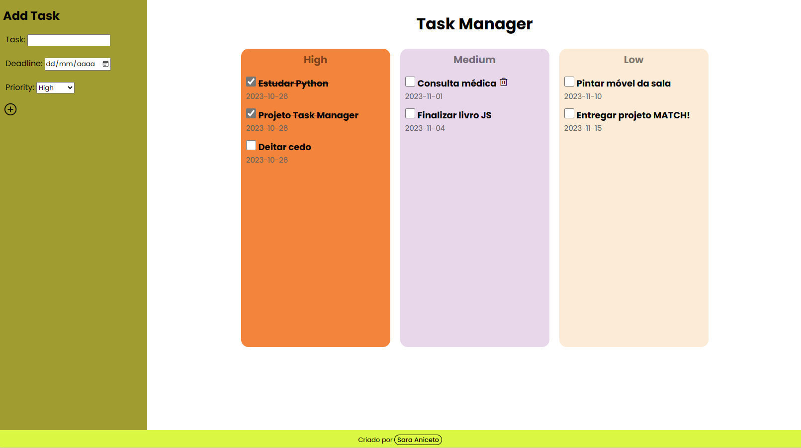

# Task Manager
Aplicação de gerenciamento de tarefas criada como trabalho de conclusão da Formação MATCH!, uma parceria da Mastertech com a IBM.
- [Acesse o projeto finalizado, online](https://task-manager.saraaniceto.vercel.app/)
  

    

## :gear: Features:
- Adicionar tarefa com prazo marcado
- Validação de prazo e prioridade
- Lista de prioridades separadas
- Marcar tarefa como concluída
- Remover tarefas
  

## :rocket: Tecnologias usadas:
- HTML
- CSS
- Python
- Flask
